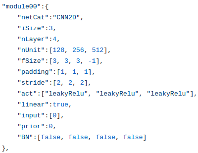
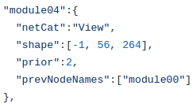
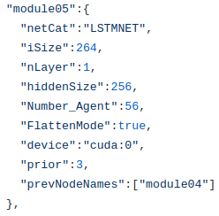
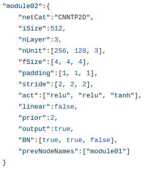

# baseline

This repo is basic tool for Reinforcement Learning

it supports for making Network Architecture by using .json file.

basically, there are availiable network types.

1. MLP
2. CNN2D
3. LSTMNET
4. CNN1D
5. Cat,
6. Unsequeeze
7. View
8. GoAvgPooling
9. RESCONV2D
10. RESCONV1D
11. AvgPooling

CNN Type
------

1. MLP

2. CNNs

3. View

4. LSTMNET

5. CNNTP2D

pseudoCode

baseAgent
    Initialize priorityModel, outputModel, inputModel, name2prior
<!-- priorityModel:  -->
    inputs =[input01, input02, input03]
    for i, input in inputs:
        info_input = inputModel[i]
        info_input: [[prior, module name01], [prior, module name02]..]
        for info in info_input:
            prior, module name = info[0], info[1]
            priorityModel[prior][module name].addinput(inputs[i]) -> node
        
    
    for prior in range(max prior + 1):
        for module name in priorityModel[prior].keys():
            priorityMdoel[prior][module name].step()
    
    output = []
    for info self outputModel:
        info :[prior, modulename]
        out = priorityModel[prior][modulename].getoutput()
        for o in out:
            output.append(o)
    
    output = tuple(output)
    clear_output()
    return output

node : storeinputs, prevnodes

    addinput(input)
        if input == tuple:
            storeinputs.deepcopy(input)
        else:
            storeinputs.append(_input.clone())

    step():
        if len(prevnodes) != 0:
            for node in prevnodes:
                for input in node.output()
                    inputs.append(input)
        
        storedinput = tuple(inputs)
        output = self.model