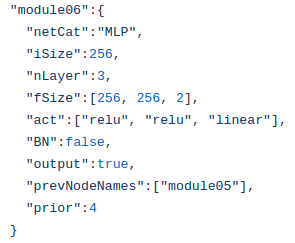

# baseline

This repo is basic tool for Reinforcement Learning

it supports for making Network Architecture by using .json file.

basically, there are availiable network types.

1. MLP
2. CNN2D
3. LSTMNET
4. CNN1D
5. Cat,
6. Unsequeeze
7. View
8. GoAvgPooling
9. RESCONV2D
10. RESCONV1D
11. AvgPooling

CNN Type
------

1. MLP

2. CNNs

3. View

4. LSTMNET

5. CNNTP2D

